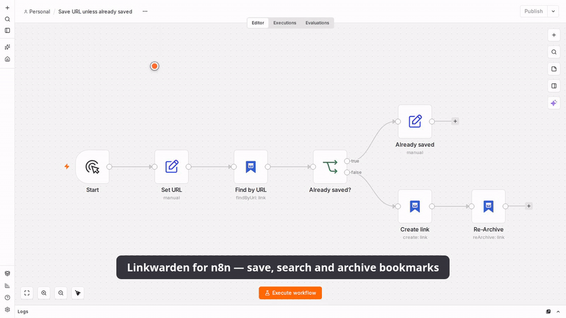

# n8n-nodes-linkwarden

[](https://www.npmjs.com/package/@t0mer/n8n-nodes-linkwarden)
[](LICENSE)

n8n community nodes for [Linkwarden](https://linkwarden.app), the self-hosted, collaborative
bookmark manager that preserves pages as screenshots, PDFs, readable text and single-file HTML.

- **Linkwarden**: an action node for links, collections, tags, highlights, archives, RSS
  subscriptions and the current user. It can be used as an **AI Agent tool**.
- **Linkwarden Trigger**: a polling trigger that fires when a **new link** is saved,
  optionally only for one collection or tag.

The common automation, *"save this URL unless it's already saved"*, is built in with **Find by
URL** and the **On Duplicate** option of **Link → Create**.

Tested against **Linkwarden v2.16.3** (self-hosted, with and without Meilisearch). It works with
self-hosted instances and with Linkwarden Cloud.



[Watch the full demo video (MP4)](assets/demo/linkwarden-demo.mp4)

> This package is unofficial. It is not affiliated with, endorsed by, or supported by the
> Linkwarden project. "Linkwarden" is used only to describe what the nodes connect to.

- [Installation](#installation)
- [Credentials](#credentials)
- [Operations](#operations)
- [Search syntax](#search-syntax)
- [Trigger](#trigger)
- [Known Linkwarden API quirks](#known-linkwarden-api-quirks)
- [Example workflows](#example-workflows)
- [Development](#development)

## Installation

On a self-hosted n8n instance:

1. Go to **Settings → Community Nodes**.
2. Select **Install**, enter `@t0mer/n8n-nodes-linkwarden`, and confirm.

See the n8n guide to [installing community nodes](https://docs.n8n.io/integrations/community-nodes/installation/)
for other options (for example, installing manually with npm in a queue-mode setup).

## Credentials

The nodes authenticate with a Linkwarden **access token**.

1. In Linkwarden, open **Settings → Access Tokens** and create a token. Pick an expiry that fits
   your workflow; "never" is convenient for long-running automations.
2. In n8n, create a **Linkwarden API** credential:

| Field | Description |
|---|---|
| Base URL | Your Linkwarden address, for example `https://links.example.com`. Use `https://cloud.linkwarden.app` for Linkwarden Cloud (the default). A trailing slash is fine. |
| Access Token | The token from step 1. |
| Ignore SSL Issues (Insecure) | Turn on only for a self-hosted instance with a self-signed certificate. |

The credential test calls `GET /api/v1/users/me`.

## Operations

| Resource | Operations |
|---|---|
| Link | Create, Find by URL, Get, Get Many, Search, Update, Pin, Unpin, Delete, Delete Many, Bulk Update, Re-Archive, Delete Archives |
| Collection | Create, Get, Get Many, Update, Delete |
| Tag | Create, Get, Get Many, Rename, Delete, Delete Many |
| Highlight | Create or Update, Get Many, Delete |
| RSS Subscription | Create, Get Many, Delete |
| Archive | Download, Upload to Link, Upload as New Link |
| User | Get Me |

Collection and tag fields are pickers with **From List**, **By ID**, and (collections only)
**By Name** modes. The list shows nested collections as paths such as `Work / Research`. By Name
matches a name or a full path, ignoring case. It fails with a clear error when nothing matches,
or when several collections share the name (the error lists their IDs).

Every **Get Many** operation has **Return All** and **Limit** (default 50). Results stop at
10,000 items, with a hint in the output panel.

Operations that take a list of IDs (**Delete Many**, **Bulk Update**, **Delete Archives**, and Tag
**Create** / **Delete Many**) have a **Run Once** option, on by default. It reads the IDs from
the first input item only and sends one request. Turn it off to run once per input item.

The **Request Options → Max Retries** setting (default 3) retries on rate limiting (429),
server errors (5xx) and network errors. Waits back off exponentially and honor `Retry-After`.
Link creation (POST) is never retried after a timeout, so a slow server can't make it save the
same link twice.

### Simplified link output

**Simplify** is on by default for every operation that returns links. It returns:

```json
{
  "id": 42,
  "name": "Example Article",
  "url": "https://example.com/article",
  "description": "Saved for later",
  "type": "url",
  "collectionId": 3,
  "collectionName": "Read Later",
  "tags": ["news", "dev"],
  "pinned": false,
  "createdAt": "2026-09-01T09:59:00.000Z",
  "updatedAt": "2026-09-01T10:00:00.000Z",
  "preservedAt": "2026-09-01T10:00:00.000Z",
  "archives": { "screenshot": true, "pdf": true, "readable": true, "monolith": false }
}
```

Turn **Simplify** off to get the raw Linkwarden object.

### Create and duplicates

**Link → Create** always outputs `duplicate: true | false`. **Options → On Duplicate** decides
what happens when the URL is already saved:

| On Duplicate | Result |
|---|---|
| Return Existing Link (default) | Outputs the saved link with `duplicate: true` |
| Skip | Outputs nothing for that item |
| Throw Error | Fails the item |

Linkwarden only rejects duplicates when **Prevent duplicate links** is on in your Linkwarden
settings. When it's off, turn on **Options → Check for Duplicates First**, which runs Find by URL
before saving.

> With Meilisearch, Linkwarden indexes a new link a few seconds after saving it. Until then,
> Find by URL (and so **Check for Duplicates First**) can't see it. Creating the same URL twice
> within seconds can therefore still produce a duplicate unless **Prevent duplicate links** is on.

**Find by URL** never fails when nothing matches. It returns
`{ found, matches, link }`, where `link` is the first match or `null`. URLs are compared after
normalizing them:

- letter case in the scheme and host is ignored;
- a leading `www.`, trailing slashes and the `#fragment` are dropped;
- the path and query are compared exactly.

### Updating links

**Link → Update** only changes the fields you add. Linkwarden's API replaces the whole link on
update, so the node first reads the link and sends the current value of every field you didn't
touch. **Tag Mode** controls the **Tags** field:

| Tag Mode | Effect |
|---|---|
| Add (default) | Keeps the current tags and adds the listed ones |
| Remove | Removes the listed tags |
| Replace | Sets exactly the listed tags (an empty list clears all tags) |

Changing the **URL** makes Linkwarden delete the existing archives and preserve the new page.
Only the owner of a collection can move links out of it.

### Archive formats

| Format | Download | Upload | MIME type | File name |
|---|---|---|---|---|
| Screenshot (PNG) | ✓ | ✓ | `image/png` | `linkwarden-<id>.png` |
| Screenshot (JPEG) | ✓ | ✓ | `image/jpeg` | `linkwarden-<id>.jpeg` |
| PDF | ✓ | ✓ | `application/pdf` | `linkwarden-<id>.pdf` |
| Readable (JSON) | ✓ | | `application/json` | `linkwarden-<id>.json` |
| Single-File HTML | ✓ | ✓ | `text/html` | `linkwarden-<id>.html` |

- **Download** of Readable (JSON) also parses the file into the `readable` output field. Turn
  off **Parse Readable Content** to skip that.
- **Preview** downloads the small thumbnail instead.
- A missing format returns *"This link has no … archive yet. Try Re-Archive or another format."*
- **Uploads** check the input file's MIME type against the format before sending.
- **Upload as New Link** saves the file in your default collection.
- Linkwarden limits upload size (`NEXT_PUBLIC_MAX_FILE_BUFFER`, 10 MB by default). The node
  can't know your server's limit, so it mentions the limit when an upload is rejected.

### Collections

**Update** reads the collection first and resends every field you didn't change, including the
current **members**. Linkwarden requires the member list on every update and replaces sharing
with it, so the node always sends the existing members unchanged. Managing members isn't
supported yet.

**Delete** removes the collection **and every link inside it**. This can't be undone.

For **RSS Subscription → Create**, a collection chosen **By Name** reuses an existing collection
with that name (ignoring case). Linkwarden creates the collection only when none exists.

## Search syntax

**Link → Search** sends the query to Linkwarden's search.

- **With Meilisearch** enabled on the server, the query supports field tokens:
  `url:`, `name:`, `description:`, `type:`, `collection:`, `tag:`, `pinned:`, `public:`,
  `before:` and `after:`. For example: `tag:news after:2025-01-01 kubernetes`.
- **Without Meilisearch** the query is a plain "contains" match on the link name, URL,
  description and tag names.

The **Collection**, **Tag** and **Pinned Only** filters work in both cases.

## Trigger

Linkwarden has no outgoing webhooks, so **Linkwarden Trigger** polls. Every 5–15 minutes is
usually enough.

- **First activation**, or any change to the filters, records the newest link and emits nothing.
  Later polls emit links saved since then, oldest first. Old links that are later moved into
  the watched collection, or later get the watched tag, don't fire.
- New links are detected by link ID. Imported links with old dates are still caught.
- **Collection** and **Tag** narrow the links that fire the trigger.
  **Options → Include Subcollections** also matches links in nested collections.
- **Options → Max Links per Poll** (default 100, max 500) caps each poll. When more links
  arrive, the newest are emitted and the last item gets `truncated: true`.
- **Fetch Test Event** returns up to 5 recent matching links without changing the trigger's
  state.

## Known Linkwarden API quirks

These are handled by the node. They matter if you call the API yourself with the HTTP Request
node.

- **Three response envelopes.** Most routes return `{ "response": … }`. `GET /api/v1/tags`
  returns `{ "data": { "tags", "nextCursor" } }`. `GET /api/v1/search` returns
  `{ "data": { "links", "nextCursor" } }`, or `data: []` when Meilisearch finds nothing.
- **Listing links uses search.** `GET /api/v1/links` is deprecated (servers can turn it off
  with `DISABLE_DEPRECATED_ROUTES`), so Get Many and the trigger call `GET /api/v1/search`
  without a query. It takes the same filters and sort.
- **Pagination.** Search and tags return an opaque `nextCursor`, which is an offset with
  Meilisearch and a link ID without it. With Meilisearch, collection and tag filters are
  applied after paging, so a page can be empty while `nextCursor` still points to more.
- **Missing items.** An unknown link returns `401 "Collection is not accessible."` instead of
  404, and an unknown collection returns `200` with `null`. The node turns both into clear
  errors.
- **Link update replaces the link.** `PUT /api/v1/links/{id}` needs the full object, including
  `collection: { id, ownerId }` and the complete `tags` list. A missing name or description is
  saved as empty.
- **Pin and unpin** go through the same update route. Pin sends `pinnedBy: [{ id: <your user
  id> }]` and unpin sends `pinnedBy: [{}]`.
- **Collection create** is `POST /api/v1/collections`. The OpenAPI spec wrongly documents
  `POST /api/v1/collections/{id}`.
- **Collection update** requires `members` and replaces all members with it. Sending `[]`
  removes all sharing.
- **Tag create** uses `label`, not `name`: `{ "tags": [{ "label": "news" }] }`.
- **Archive `preview`** is treated as true whenever the parameter is present, even
  `preview=false`.
- **HTTP 401** means a bad token, but Linkwarden also uses it for permission errors, e.g.
  "Collection is not accessible.". The node shows those messages as-is.

## Example workflows

Import these from [`examples/`](examples/) (**Workflow menu → Import from File**) and select your
credentials:

| File | What it does |
|---|---|
| [`save-url-unless-saved.json`](examples/save-url-unless-saved.json) | Chat message → extract URL → Find by URL → create the link if it's new → reply |
| [`rss-to-linkwarden.json`](examples/rss-to-linkwarden.json) | RSS feed items → Create with tags → Re-Archive |
| [`read-later-digest.json`](examples/read-later-digest.json) | Trigger on new links in "Read Later" → summarize → send by email |
| [`weekly-rearchive-missing-pdf.json`](examples/weekly-rearchive-missing-pdf.json) | Every week: find links without a PDF archive → Re-Archive |
| [`ai-agent-linkwarden-tool.json`](examples/ai-agent-linkwarden-tool.json) | AI Agent that can search and save links through Linkwarden |

## Development

```bash
npm ci
npm run lint
npm run build
npm test          # vitest; never calls a real Linkwarden
npm run dev       # n8n with this node loaded, hot reload
```

Releases are date-based (`YYYY.M.PATCH`). Push a tag and the **Publish** workflow publishes
the package to npm with provenance:

```bash
VERSION="$(./scripts/next-version.sh)"
git tag "$VERSION" && git push origin "$VERSION"
```

## License

[MIT](LICENSE)
